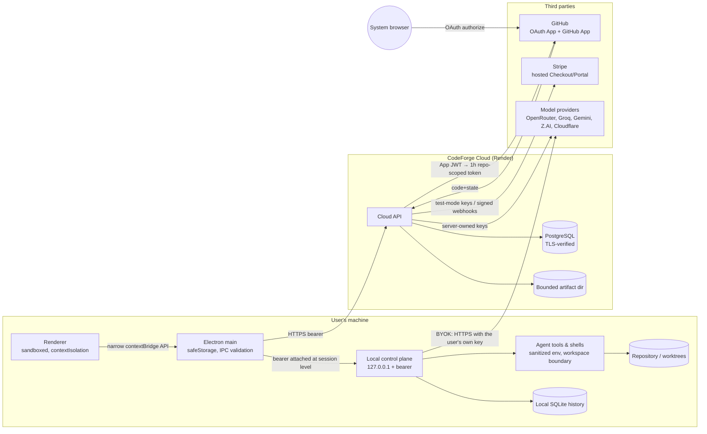

# CodeForge Security Architecture

CodeForge is three cooperating pieces. Security follows from keeping their authority separate.

| Piece | Runs where | Holds what | Trusts what |
| --- | --- | --- | --- |
| **Desktop app** (`apps/desktop`, Electron) | The user's machine | BYOK provider keys and CodeForge Cloud session tokens, sealed with OS-backed storage; the local task history (SQLite); the user's repositories | Only its own renderer document, only over a per-process bearer |
| **Local control plane** (`packages/server`, embedded in the desktop, `forge serve`, and the VS Code extension) | The user's machine, loopback only | The agent runtime, tool execution, workspace boundary, provider adapters | Requests that present the per-process bearer from an allowed origin with a loopback `Host` |
| **CodeForge Cloud API** (`apps/cloud-api`) | Render (Docker) + Supabase/Neon PostgreSQL | Platform provider keys, GitHub OAuth/App secrets, the JWT signing secret, data-encryption keys, Stripe test keys — all in environment variables; accounts, sessions (hashed), usage, billing metadata, sealed OAuth verifiers, publication metadata in PostgreSQL | Only bearer tokens whose device session is still live, or the `__Host-` browser cookie; webhook bodies only with a valid Stripe signature |

## Trust boundaries

Trust flows in one direction only: the Cloud never trusts the desktop's description of who it is
(only the token), the local control plane never trusts the renderer's description of what it may
run (only validated IPC + bearer), and agent tools never receive the process environment.

## Control plane vs. execution plane

| | Control plane | Execution plane |
| --- | --- | --- |
| What it is | Cloud API process; Electron main process; local server process | Shell commands, verification commands, git subprocesses, model tool calls |
| Credentials it holds | Platform keys, JWT secret, encryption keys, BYOK keys (desktop), Cloud tokens (desktop) | **None.** Child processes receive `getSanitizedEnvForChild()` — the host environment minus every credential-shaped variable (`packages/secrets/src/env-filter.ts`) |
| How it reaches providers | Server-side adapters inject `Authorization` at the HTTP transport; the model sees request/response content only | Cannot: no key is present in the environment or the workspace |
| Boundary tests | `tests/security/attack-acceptance.test.ts` (ATTACK-004/005), `packages/server/test/hardening-adversarial.test.ts` | same |

## Request paths that matter

1. **Desktop sign-in** — server-brokered OAuth with two PKCE pairs (desktop-owned and server-owned), a fixed HTTPS callback, a 120-second single-use hashed handoff code, and token minting only on proof of the desktop verifier. See [session-and-api-security.md](./session-and-api-security.md).
2. **Hosted Free inference** — desktop → `POST /v1/hosted/inference` (bearer, live session) → ForgeZero + privacy-mode routing → provider adapter with the server-owned key → SSE stream back. Prompts are not persisted; only usage accounting is.
3. **BYOK inference** — desktop local control plane → provider directly, with the user's own key read from OS-backed storage at call time. The Cloud is not in the path.
4. **Publication** — desktop uploads a git bundle (≤256 MiB, SHA-256 verified) → Cloud mints a one-repository, one-hour GitHub App token → push + PR → bundle deleted. See [github-access-model.md](./github-access-model.md).
5. **Billing** — desktop asks the Cloud for a Stripe Checkout/Portal URL (return URLs restricted to trusted origins); Stripe hosts the card form; Stripe signs webhooks; the Cloud grants only on `payment_status = paid`.

## What the architecture deliberately does not do

- It does not store passwords (there are none — GitHub is the only identity provider).
- It does not store GitHub OAuth access tokens (used once to read the profile, then discarded).
- It does not store card data (Stripe hosts every payment form).
- It does not put platform secrets in any client bundle, renderer, log, or child process.
- It does not let the renderer, a model, or a tool call obtain the local control-plane bearer.
